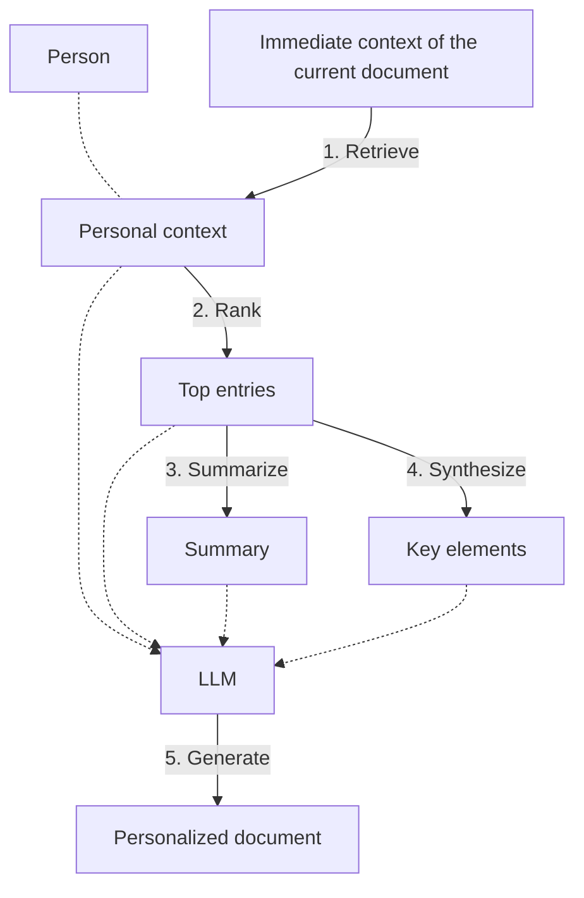

# llm-multistage-multitask-framework
Demo of the paper: Teach LLMs to Personalize – An Approach inspired by Writing Education

## The overview of the multistage multitask framework for personalized text generation

## Reference
- Original Paper: [Teach LLMs to Personalize – An Approach inspired by Writing Education](https://arxiv.org/abs/2308.07968)